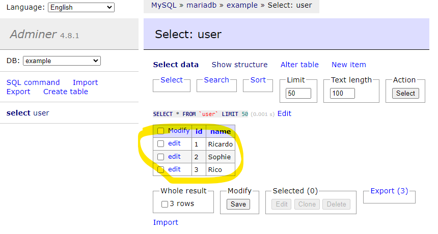

# Create a Custon MariaDB Docker container with a table _user_

This repository shows how to create a customised MariaDB with a table _user_ and a few rows rows. Execute all the commands where the files below are;
- docker-compose.yml
- dockefile
- INSERT.sql
- CREATE.sql

##### 1. Create image

```shell
docker build -t mariadb-custon:latest .
```

Output
```shell
#1 [internal] load build definition from Dockerfile
#1 sha256:979cc6b48eae35177aeb8db4a00f89f4697f2dcafd1431ce8021918a74a3595e
#1 transferring dockerfile: 32B done
#1 DONE 0.0s
...
... [1/3] FROM docker.io/library/mariadb:latest@sha256:b06fd5ee691b7bd38ee71db35da0bc9a8b2fc5efb76edeca32fda181727e0218
...
... [2/3] COPY CREATE.sql /docker-entrypoint-initdb.d/
...
... [3/3] COPY INSERT.sql /docker-entrypoint-initdb.d/
...
... DONE 0.0s
```

##### 2. Tag the image to the remote repository

```shell
docker tag mariadb-custon:latest ricardorqr/mariadb-custon
```

##### 3. push the new image

```shell
docker push ricardorqr/mariadb-custon
```

Output

```shell
Using default tag: latest
The push refers to repository [docker.io/ricardorqr/mariadb-custon]
...
denied: requested access to the resource is denied
```

##### 4. Adminer

- URL: http://localhost:8080/?server=mariadb
- Username: root
- Password: example
- Database: example

Output


